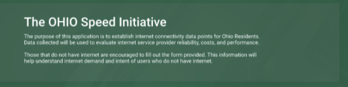

# SpeedTestUi

The purpose of this project is to help State of Ohio and it's educational agencies to better support local residents internet access.

## Steup

### To check this out to your local

### Dependencies:

1. install node on your machine:
   https://nodejs.org/en/download/

2. a tool npm should be installed with step one, follow this page to make sure it is installed
   https://www.npmjs.com/get-npm

3. now your command line tool should have npm installed
   you can do `npm version` to verify
   we need to install angular cli (command line interface, you will see this term a lot, a lot) too
   `npm install -g @angular/cli`

### Run app locally now

Run `ng serve` for a dev server. Navigate to `http://localhost:4200/`. The app will automatically reload if you change any of the source files.

If you can see the app running, move to next steps

## Your task.

This is the website mock up we need to use to create this application.
https://xd.adobe.com/view/02087bfe-6b63-4dc6-9b4c-49feca055797-575b/screen/aa4303a2-4edb-42f4-a68a-91a341fffe06/specs/

You will follow these steps just like doing your homework

### A. Review code (You just need to understand highlevel how this app works)

1. Review the code under /src/app directory
2. The app starts src/index.html but where we really care is src/app/app.component.html
3. You will work in homepage component, add something just to see if it works. If you can, add the UI element below to the homepage component.

Format: 

## All insturctions below are good to know but not required to know

## Code scaffolding

Run `ng generate component component-name` to generate a new component. You can also use `ng generate directive|pipe|service|class|guard|interface|enum|module`.

## Build

Run `ng build` to build the project. The build artifacts will be stored in the `dist/` directory. Use the `--prod` flag for a production build.

## Running unit tests

Run `ng test` to execute the unit tests via [Karma](https://karma-runner.github.io).

## Running end-to-end tests

Run `ng e2e` to execute the end-to-end tests via [Protractor](http://www.protractortest.org/).
